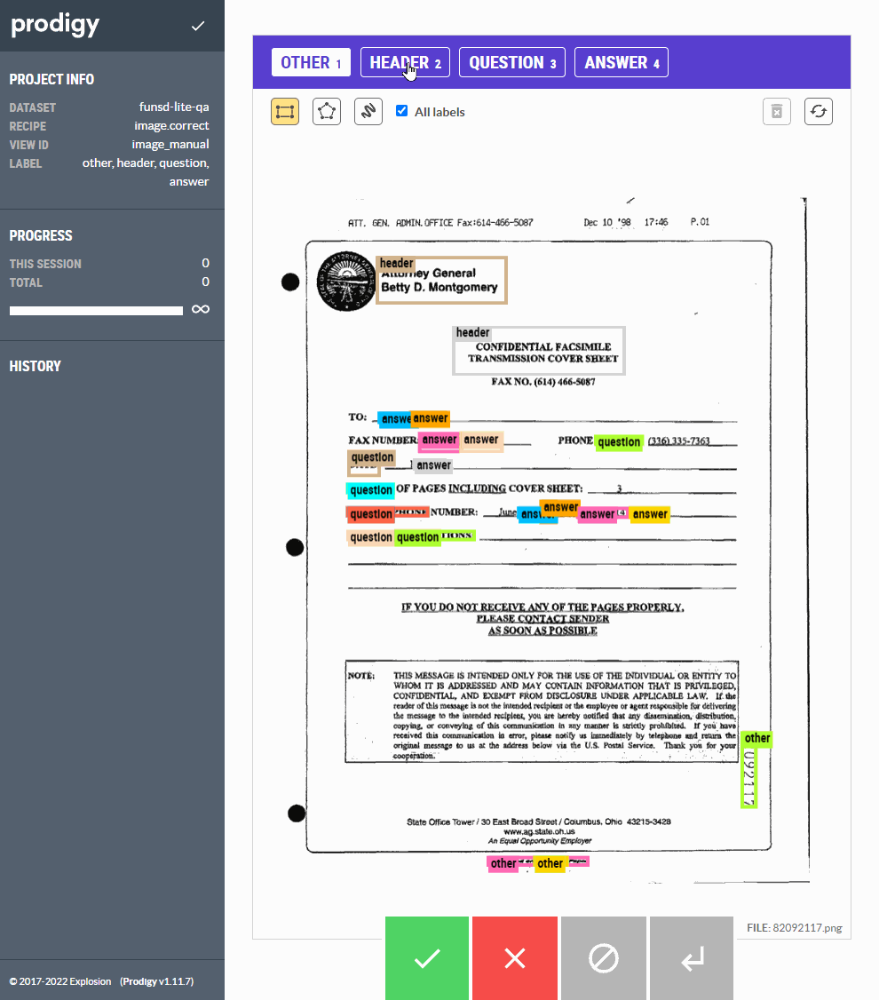

<!-- SPACY PROJECT: AUTO-GENERATED DOCS START (do not remove) -->

# 🪐 spaCy Project: Prodigy recipes for document processing and layout understanding

This repository contains recipes on how to use [Prodigy](https://prodi.gy) and
[Hugging Face](https://huggingface.co) for annotating, training, and reviewing
document layout datasets.  We'll be finetuning a
[LayoutLMv3](https://arxiv.org/abs/2204.08387) model using
[FUNSD](https://guillaumejaume.github.io/FUNSD/), a dataset of noisy scanned
documents.

This also serves as an illustration of how to design document processing
solutions. I attempted to generalize this approach into a framework, which you
can read more [from my
blog.](https://ljvmiranda921.github.io/notebook/2022/07/02/a-document-processing-framework/)

## 📋 project.yml

The [`project.yml`](project.yml) defines the data assets required by the
project, as well as the available commands and workflows. For details, see the
[spaCy projects documentation](https://spacy.io/usage/projects).

### ⏯ Commands

The following commands are defined by the project. They
can be executed using [`spacy project run [name]`](https://spacy.io/api/cli#project-run).
Commands are only re-run if their inputs have changed.

| Command | Description |
| --- | --- |
| `install` | Install dependencies |
| `hydrate-db` | Hydrate the Prodigy database with annotated data from FUNSD |
| `review` | Review hydrated annotations |
| `train` | Train FUNSD model |
| `qa` | Perform QA for the test dataset using a trained model |
| `clean-db` | Drop all generated Prodigy datasets |
| `clean-files` | Clean all intermediary files |

### ⏭ Workflows

The following workflows are defined by the project. They
can be executed using [`spacy project run [name]`](https://spacy.io/api/cli#project-run)
and will run the specified commands in order. Commands are only re-run if their
inputs have changed.

| Workflow | Steps |
| --- | --- |
| `all` | `install` &rarr; `hydrate-db` &rarr; `train` |
| `clean-all` | `clean-db` &rarr; `clean-files` |

### 🗂 Assets

The following assets are defined by the project. They can
be fetched by running [`spacy project assets`](https://spacy.io/api/cli#project-assets)
in the project directory.

| File | Source | Description |
| --- | --- | --- |
| `assets/funsd.zip` | URL | FUNSD dataset - noisy scanned documents for layout understanding |

<!-- SPACY PROJECT: AUTO-GENERATED DOCS END (do not remove) -->